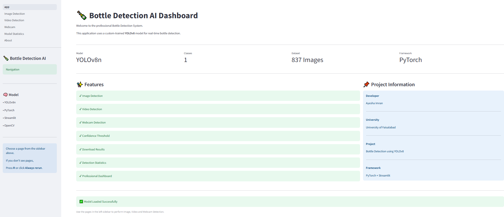
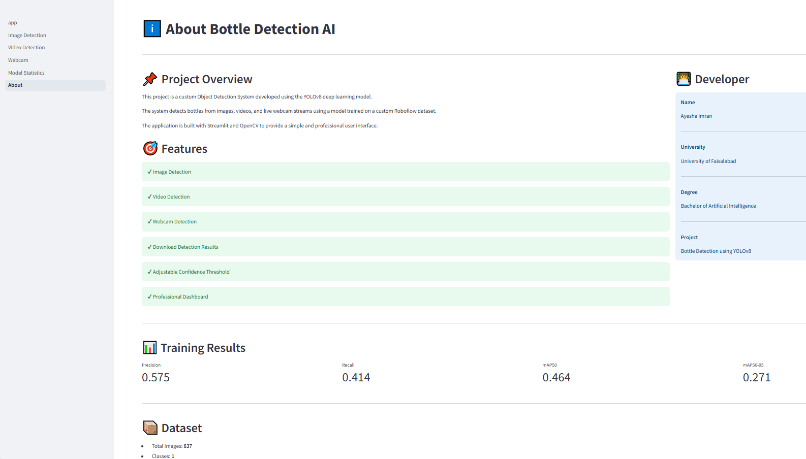
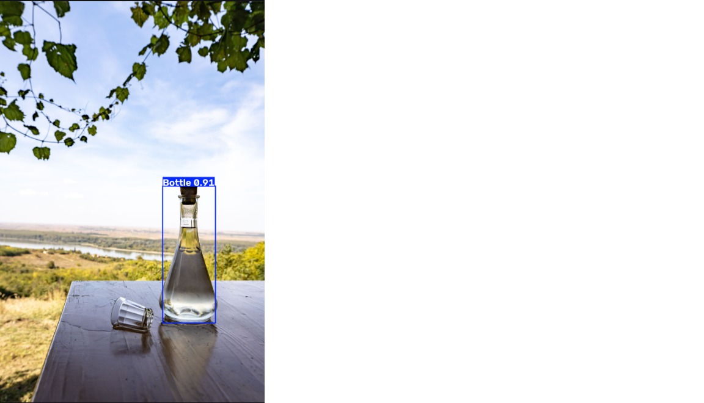
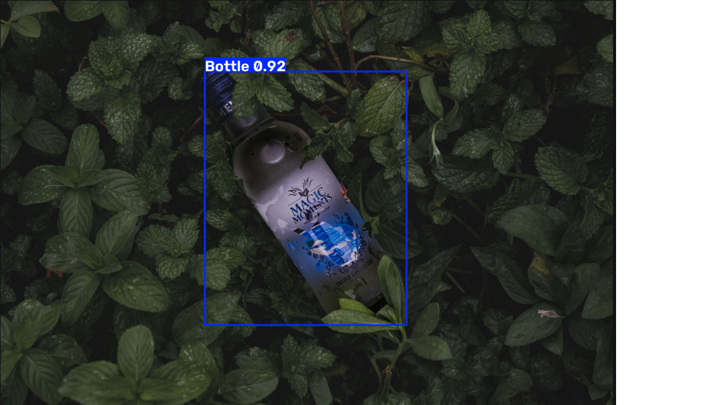
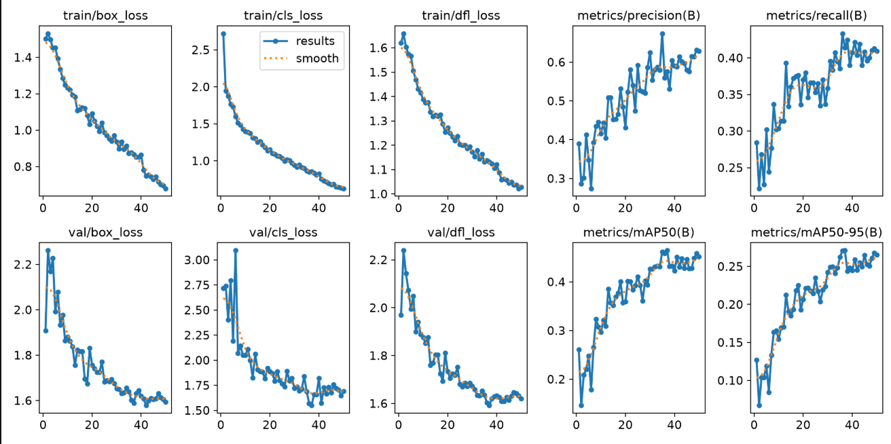
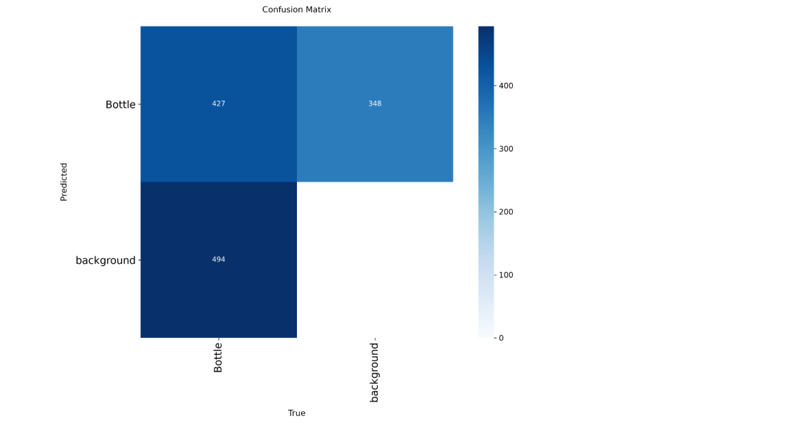

# 🍾 Bottle Detection AI using YOLOv8


---

# 📌 Project Overview

Bottle Detection AI is a Computer Vision application developed using **YOLOv8**, **PyTorch**, **OpenCV**, and **Streamlit**.

The system can detect bottles from:

- 🖼 Images
- 🎥 Videos
- 📷 Live Webcam

using a custom-trained deep learning model.

---

# 🚀 Features

✅ Professional Streamlit Dashboard

✅ Image Detection

✅ Video Detection

✅ Live Webcam Detection

✅ Confidence Threshold Adjustment

✅ Detection Statistics

✅ Download Detection Results

✅ Model Information

✅ About Page

---

# 🖥 Dashboard Preview

## Home Page



---

## Image Detection


---

## Video Detection


---

## Webcam Detection


---

## Model Statistics


---

## About Page



---

# 📊 Sample Predictions

### Prediction 1



### Prediction 2



---

# 📈 Model Evaluation

### Training Results



---

### Confusion Matrix



---

## Performance Metrics

| Metric | Value |
|---------|-------|
| Precision | *(Your value)* |
| Recall | *(Your value)* |
| mAP50 | *(Your value)* |
| mAP50-95 | *(Your value)* |

---

# 📂 Project Structure

```text
Bottle Detection Project/

├── app.py
├── train.py
├── predict.py
├── webcam.py
├── README.md

├── dataset/

├── documentation/
│   ├── Research Report.pdf
│   ├── Evaluation Report.pdf
│   ├── Builder Journal.pdf
│   └── System Architecture.pdf

├── pages/
│   ├── 1_Image_Detection.py
│   ├── 2_Video_Detection.py
│   ├── 3_Webcam.py
│   ├── 4_Model_Statistics.py
│   └── 5_About.py

├── runs/

├── screenshots/

├── weights/
│   └── best.pt
```

---

# 🧠 Model Details

| Property | Value |
|-----------|-------|
| Model | YOLOv8n |
| Framework | PyTorch |
| Detection Type | Single-Class Object Detection |
| Object Class | Bottle |
| Dataset | Custom Roboflow Dataset |
| Images | 837 |
| Deployment | Streamlit |

---

# 🛠 Technologies Used

- Python
- YOLOv8
- Ultralytics
- PyTorch
- OpenCV
- Streamlit
- Pillow
- NumPy

---

# ⚙ Installation

Clone the repository

```bash
git clone https://github.com/YOUR_USERNAME/Bottle-Detection-AI.git
```

Move into the project

```bash
cd Bottle-Detection-AI
```

Create virtual environment

```bash
python -m venv .venv
```

Activate environment

Windows

```bash
.venv\Scripts\activate
```

Install dependencies

```bash
pip install -r requirements.txt
```

Run the application

```bash
streamlit run app.py
```

---

# 📄 Documentation

This project includes:

- 📘 Research Report
- 📙 Evaluation Report
- 📗 Builder Journal
- 📕 System Architecture

Located inside the **documentation/** folder.

---

# 🎯 Future Improvements

- Improve detection accuracy
- Support multiple object classes
- Deploy online using Streamlit Cloud
- Mobile-friendly interface
- Object Tracking
- Performance Optimization

---

# 👩‍💻 Developer

**Ayesha Imran**

Bachelor of Artificial Intelligence

University of Faisalabad

Computer Vision Engineering Project

2026

---

## ⭐ If you like this project, don't forget to star the repository.